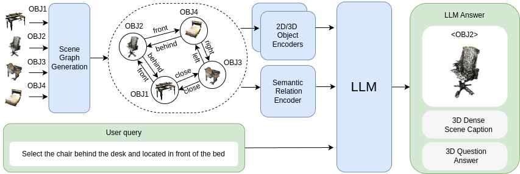

# 🤝 Contributing
We sincerely welcome paper updates/ contributions of any kind (and please do that lol)! Feel free to *open issues* or *create pull requests*. <br> 

## Adding New Papers
If you want to add new papers to the existing list, please modify the README.md and follow the format in the table:

```markdown
| year/month  | [Title of the Paper](Arxiv Link)  |  | [Github](Github Link) |
```

### Recommended Guidelines:
- Detect the earliest date of the paper, and place it properly in ascending order of the date.
- If possible, use arXiv links rather than links from other resources (e.g. conference page), and provide link to the *abstract* instead of PDF page.
- If the paper is accepted by a conference or journal, please add tag . See existing cases.
- An introduction must be added in the /imgs folder, which should be the overview of the method. Keep it as aesthetically pleasing as possible; avoid leaving too much blank space.
- If the Github link is available, please add it; otherwise, use "-" instead.

### Examples

```markdown
| 2024/12 |  <br/> [3DGraphLLM: Combining Semantic Graphs and Large Language Models for 3D Scene Understanding](https://arxiv.org/abs/2412.18450) |  | [Github](https://github.com/CognitiveAISystems/3DGraphLLM) |
```
```markdown
| 2025/05 | [Boosting MLLM Capabilities in Visual-based Spatial Intelligence](https://arxiv.org/abs/2505.24625) |  | [Github](https://github.com/diankun-wu/Spatial-MLLM) |             
```
